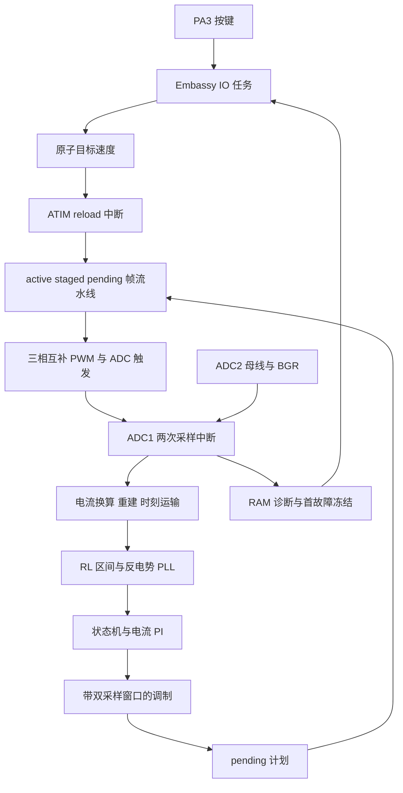
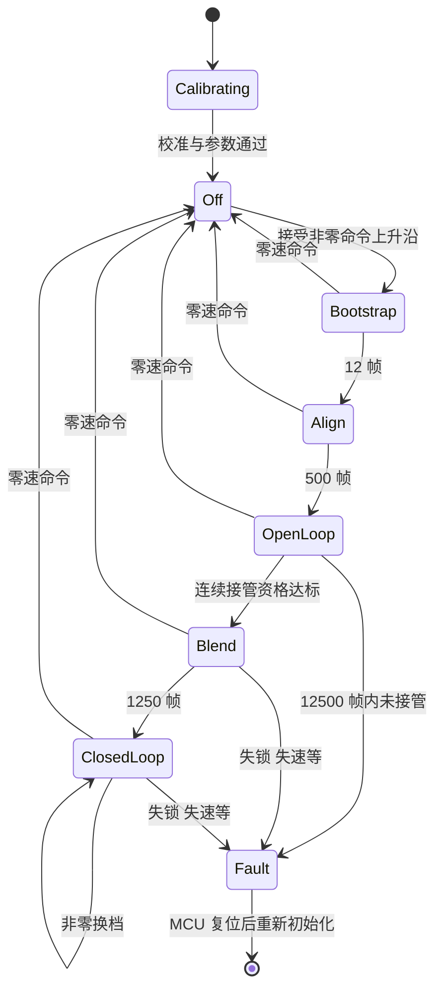

# 07 无感 FOC 架构 控制逻辑与控制频率报告

日期：2026-10-07。对象：`examples/l012-bldc/07-sensorless-foc` 当前工作区与已下载的 2.5 kHz 固件。

当前 07 是单电阻采样、反电势观测器加 PLL 的无感 FOC 实验实现。高频控制由中断同步执行，Embassy 任务负责初始化、按键、LED 和停机后的日志输出。它已经具备完整的电流环、启动与接管状态机、速度环、采样调制约束和故障关断路径，但**当前扩大输出额度的版本尚未完成闭环实机验证**：最近一次试验在 OpenLoop 运行 5 秒后因接管条件不满足而关断。

**2.5 kHz 是当前计算量与采样调度之间的折中，不是电机参数表规定的频率，也不是已经测定的芯片能力极限。** 现有实现把大量工作集中在第二次电流采样后，实测该段峰值约 133.35 µs；扩大到 65% 最大占空比后，最坏采样位置留下约 138.15 µs。两者只有约 4.79 µs 的参考差额，并且实测峰值不包含所有闭环工况。

本报告只分析现状，不修改固件、不启动电机。架构与参数以源码为准；耗时与运行结论以指定日志为准；预算公式和相位误差表是计算分析，不是独立转速或角度测量。

## 1 版本与证据范围

| 项目 | 当前值 |
|---|---|
| Git 基线 | `569ed2c569c80584219bc64d3e467c8ee95ecca5` |
| 工作区 | 在基线上有未提交的调试修改，不能只用提交号复现当前固件 |
| MODEL_TAG | `5a62df7d63f1a6208d002c6b10722d380f653242baf152db8955422a84313c9f` |
| 已构建 ELF SHA256 | `a50d1f003df179e7dc2db2438750fb936d48c2f250eb60a5ab3a4df7ecea3229` |
| 最新实机记录 | [扩大输出额度日志](2026-10-07-myh4621f-expanded.log) |
| 电机资料 | [用户提供的 MYH-4621F 参数表](myh-4621f-parameters.png) |
| 历史稳定记录 | [4 kHz 提前接管调试记录](2026-10-07-early-handoff.md) |

MODEL_TAG 只覆盖 `arithmetic/config/control/sampling` 四个源码文件，不覆盖全部硬件与 IO 代码；完整二进制对应关系应同时看 ELF 哈希。旧 4 kHz、250 mA、约 25 电气 Hz 的成功记录，不能自动转移为当前 2.5 kHz、500 mA 启动、1.1 A 运行配置的成功证明。

## 2 模块划分与数据所有权

| 模块 | 主要职责 | 关键接口或对象 |
|---|---|---|
| [main.rs](../../examples/l012-bldc/07-sensorless-foc/src/main.rs) | 时钟初始化、Flash 加速、缓存前读取工厂标定、绑定中断、创建任务、异常入口 | `main`、`Irqs`、异常处理 |
| [config.rs](../../examples/l012-bldc/07-sensorless-foc/src/config.rs) | 电机模型、环路参数、门限、各时间尺度及整数范围校验 | 常量、`valid` |
| [hardware.rs](../../examples/l012-bldc/07-sensorless-foc/src/hardware.rs) | 外设初始化、中断调度、帧身份、ADC 校准、供电与原始采样检查、关桥和诊断 | `Runtime`、`Motor`、`Plan`、三个中断处理器 |
| [control.rs](../../examples/l012-bldc/07-sensorless-foc/src/control.rs) | 纯控制状态机、坐标变换、PI、反电势观测器、PLL、接管资格 | `Control`、`Pi`、`Observer`、`HandoffWindow` |
| [sampling.rs](../../examples/l012-bldc/07-sensorless-foc/src/sampling.rs) | 两个采样窗口、三相重建、采样时刻运输、RL 加权区间、受约束调制 | `Frame`、`Modulator`、`RlInterval` |
| [arithmetic.rs](../../examples/l012-bldc/07-sensorless-foc/src/arithmetic.rs) | 除法、余数、开方的统一语义 | `Arithmetic`，主机端 `Software` |
| [trace.rs](../../examples/l012-bldc/07-sensorless-foc/src/trace.rs) | Blend 初期连续输入、观察器初末状态和模型版本标识 | `Trace`、`Seed`、`ReplayState` |
| [io.rs](../../examples/l012-bldc/07-sensorless-foc/src/io.rs) | PA3 六档命令、消抖、PC13 LED、停机日志输出 | `io_task`、毫秒唤醒 |
| HAL 的 [single_shunt.rs](../../embassy-cw32/src/motor/single_shunt.rs) | ATIM 配置、五路预载写入、桥臂解锁与关断 | `SingleShuntPwm` |



`MOTOR` 是中断拥有的静态运行对象。ATIM 与 ADC1 都是 P0，互不抢占，顺序访问实时状态；BTIM1 是 P3。普通任务通过独立原子命令与状态字交互，不直接借用正在运行的控制器。EAU 由 ADC1 控制路径独占，没有并发共享数学加速器的正常路径。

`motor_task` 完成初始化后永久等待，保留外设单例所有权。**电流闭环不靠 async 轮询或 Embassy 定时唤醒执行。** 不能把当前耗时简单归因于“用了异步框架”。

## 3 电机模型与当前参数

参数表给出 MYH-4621F、24N22P、KV=68 RPM/V、10–24 V、线间电阻 6.7 Ω、静态电感 1.75 mH，并列出 DC12 V、1.1 A 的控制器测试工况。22 极对应 11 对极；当前控制代码仍使用电气频率，11 对极主要用于解释机械转速，未参与闭环测速转换。

1.1 A 未注明母线还是相电流，也未注明 RMS 或峰值。当前将其用作 FOC 的 Iq 指令额度，是台架配置，不能称为已确认的额定相电流。表中的编码器标识 5048A 没有接入本例反馈链。

| 类别 | 当前配置 | 含义 |
|---|---|---|
| CPU 与 PCLK | 96 MHz | 每微秒 96 tick |
| PWM 与主控制执行 | 2500 Hz | 每周期 400 µs、38400 tick |
| 速度环执行 | 100 Hz | 每 25 个主控制帧执行一次 |
| 电流 PI 名义带宽 | 50 Hz | 参数计算起点，不等于实测闭环带宽或执行频率 |
| 电流检测 | 10 mΩ，增益 10 | 名义 100 mV/A；5 V、12 bit 时约 12.2 mA/LSB |
| 相模型 | 3.35 Ω、875 µH | 从线间测量按平衡等效星形模型换算 |
| 对齐 Id | 300 mA | 固定电角度对齐 |
| 开环 Id 与 Blend 电流圆 | 500 mA | 启动阶段额度 |
| Blend 最小目标 Iq | 100 mA | 保持正向转矩，仍受斜坡和电流圆约束 |
| 闭环 Iq | 0–1100 mA | 单向转矩，无负 Iq 主动制动 |
| 电流命令斜坡 | 3 mA/帧 | 名义 7.5 A/s |
| 原始及重建过流门限 | 1800 mA | 软件/ADC 看门狗路径，不是独立硬件瞬时限流保证 |
| 母线门限 | 9.9–16 V | 当前 3S／约 12 V 台架；没有按电机 24 V 上限提高板级供电 |
| 电压圆 | 10240/32768 × Vbus | 0.3125 Vbus，12 V 时约 3.75 V |
| 电流 PI Q15 | Kp=9008，Ki=13795 | Ki 已包含标称采样周期，并按实际间隔修正 |
| 速度 PI Q15 | Kp=123，Ki=1 | 电气速度误差输入，输出 mA |
| 速度参考斜坡 | 100 mHz/10 ms | 10 电气 Hz/s |
| 反电势低通 | 13/64，Q8 状态 | 用于 PLL 输入 |
| 速度反馈低通 | 1/40，Q8 状态 | 2.5 kHz 更新后供 100 Hz 速度 PI 使用 |
| PLL | Kp=16384，Ki=256 | 速度限幅 ±180 电气 Hz |
| 超速门限 | 165 电气 Hz | 约 900 rpm，仅为软件配置 |

电气与机械速度关系：`rpm = 60 × 电气Hz / 11`。

| 档位 | 目标电气频率 | 对应机械目标 |
|---|---:|---:|
| 0 | 0 Hz | 停机 |
| 1 | 30 Hz | 约 164 rpm |
| 2 | 60 Hz | 约 327 rpm |
| 3 | 90 Hz | 约 491 rpm |
| 4 | 120 Hz | 约 655 rpm |
| 5 | 150 Hz | 约 818 rpm |

12 V × 68 RPM/V ≈ 816 rpm 是 KV 空载估算，不是当前 FOC 在受限调制度和实际负载下的实测最高转速。

## 4 上电和人机操作

`main` 先建立 96 MHz 时钟，在启用 Flash 预取/缓存前读取工厂 BGR 标定半字，随后启用加速并回读三等待周期等配置。缓存开启后的标定区读数只打印作诊断，不能替换之前保存的值；本次日志中二者确实不同。

硬件初始化先关闭电机相关中断，将六个门极引脚配置为低电平，再配置模拟输入、OPA、ADC、ATIM 和 BTIM1。ADC1 的触发与定时器开始运行时，功率输出仍关闭。ADC2 的供电参考通过后，ADC1 累积 2048 个零点样本，约需 409.6 ms，另加上首次参考就绪时间。校准要求零点在 1800–2300、样本峰峰差不超过 64 ADC 码。

PA3 上拉，必须连续释放 60 ms，再拉低 60 ms，才接受一次按键。每次循环 `0→1→2→3→4→5→0`；长按不连跳，上电一直按住不触发。调度间隔大于 2 ms 时重置消抖资格。PC13 低电平点亮，正常显示输出是否已使能；故障按编号闪烁。

命令用单个 `SPEED_REQUEST_MILLIHZ` 原子值表达，0 表示停止，非零表示目标速度，避免另一个运行标志与目标值不一致。

一个需要注意的现状：`request_speed` 只在 Off 状态接受非零命令的上升沿。如果校准尚未结束时已经发出非零命令，该上升沿不会自动排队到校准结束；之后可能需要先回到 0 档再启动。这是当前状态机行为，不是“上电自动启动”。

## 5 控制状态机



各阶段还共同受采样、供电、电流、驱动、算术和实时性保护约束，图中没有逐条重复画出故障边。

### 5.1 Bootstrap 与 Align

Bootstrap 使用三相 CCR=0 的低侧自举方式，持续 `2500/200=12` 帧，即 **4.8 ms**，不是精确 5 ms。Align 将电角度固定为 0，Id 目标 300 mA、Iq=0，持续 500 帧，即 200 ms。电流目标经过每帧斜坡，不是直接施加电压阶跃。

### 5.2 OpenLoop

OpenLoop 是有电流反馈的 I/F 启动，不是直接指定 PWM 占空比。控制角度由强制角积分产生，目标为 Id=500 mA、Iq=0；强制频率从 2 Hz 在 2.5 s 内升到 18 Hz。与此同时，反电势观测器一直更新，但它尚未决定输出角度。

强制速度达到 12 Hz 后就开始累计接管资格，无须等到加速平台。资格满足才换到观测角度；5 s 开环总期限内不能满足则 `StartupTimeout`。

高档目标 150 Hz 不会让启动阶段直接强拖到 150 Hz。所有非零档先通过相同的启动与接管流程，速度档位主要在 ClosedLoop 中生效。

### 5.3 接管资格

基础检查由 `handoff_reject_mask` 完成，连续窗口检查由 `HandoffWindow::push` 完成：

| 条件 | 当前要求 |
|---|---|
| 已开始跟踪 | `observer.tracking=true` |
| 反电势幅值 | 至少 500 mV |
| 估计旋转方向 | 正向，速度大于 0 |
| 估计速度范围 | 至少 12 Hz，低于 165 Hz |
| 强制速度 | 至少 12 Hz，才累计资格 |
| 估计与强制速度差 | 不超过 `max(强制速度/4, 2 Hz)` |
| 观测角与强制角差 | 约 −60° 到 +10° |
| 窗口内角差峰峰值 | 不超过约 20° |
| PLL 误差单帧峰值 | 不超过约 20° |
| PLL 窗口均方 | 对应 RMS 不超过约 10° |
| PLL 连续大于 10° | 达到 2 帧即拒绝，当前为 0.8 ms 的帧尺度 |
| PLL 大于 10° 的总帧数 | 50 帧资格窗口最多 2 帧，实际为 4% |
| 连续合格长度 | 50 帧，即 20 ms |
| 最终进入瞬间 | 观测角不领先强制角，即角差不大于 0 |

任一拒绝会清空连续资格，不能把分散的合格帧累加成一次接管。“有反电势”只证明存在可用于估计的信息，不保证角度、方向和稳定性已经足够。

### 5.4 Blend 的连续切换

接管帧先在原强制坐标系完成电流 PI，保留该帧原有的有界 αβ 电压。随后把电流参考、已有输出电压与 PI 内部状态重新表达在观测坐标系，用 `track_output` 使 PI 输出连续。这一步避免只换角度造成物理电压跳变。

Blend 持续 1250 帧，即 0.5 s：Id 参考逐渐降到 0，Iq 保持投影后的正向值，目标至少为 100 mA；目标仍经过 3 mA/帧斜坡和 500 mA 电流圆。Blend 不执行速度 PI，避免接管未稳时速度环过早卸掉转矩。

转换入口的参考向量另有一次以 `RUN_IQ_MAX_MA` 为边界的限幅；其输入来自原启动电流向量，不能把这一步理解为入口直接命令 1.1 A。

### 5.5 ClosedLoop

ClosedLoop 使用观测器角度，Id 目标为 0。每 25 帧，速度参考向用户档位移动 100 mHz，速度 PI 根据低通后的速度误差产生 0–1100 mA 的 Iq 指令。

进入 ClosedLoop 时，速度参考置为当时滤后速度，速度 PI 积分以现有 Iq 初始化。非零换档只改变目标，不重新自举或对齐，不清空 PI。0 档在下一个真实 reload 关桥，故障则锁存到 MCU 复位。

## 6 单电阻电流采样与重建

三相使用边沿对齐 PWM1，互补输出，外加死区 96 tick，即 1 µs。CH4/CH5 使用内部 PWM2 比较边沿，经 TRGO2 触发 ADC1 CH8。ADC1 时钟为 48 MHz，70 周期采样、15 周期转换；换算为 CPU tick，保持时刻是触发后 140 tick，EOS 是触发后 170 tick。

设三相下降沿排序为 `a、b、c`：

1. `a` 下降而另外两相上管仍导通时，母线电流满足 `Idc1 = −Ia`。
2. `b` 下降后，只剩 `c` 上管导通时，满足 `Idc2 = Ic`。
3. 由 `Ia+Ib+Ic=0` 重建第三相。

这两个样本不是同一时刻。直接使用上述静态关系，会把不同时刻的相电流混在一起。本例先用 RL 模型和上一轮反电势，把首降相电流从第一保持时刻预测到第二保持时刻，再用 KCL 重建中间相。

重建直接强制三相和为 0，因此后续 `CURRENT_SUM_LIMIT_MA=200` 不能独立证明三个相电流物理测量一致；它更多是结构完整性检查。真正的重建质量仍依赖有效窗口、正确帧身份、R/L、采样建立及逆变器非理想因素。

| 时间量 | tick | 时间 |
|---|---:|---:|
| PWM 周期 | 38400 | 400 µs |
| 最早下降沿 | 3840 | 40 µs |
| 首次消隐 | 480 | 5 µs |
| 第二次消隐 | 240 | 2.5 µs |
| 每个有效矢量最小窗口 | 960 | 10 µs |
| ADC 采样保持延时 | 140 | 1.458 µs |
| ADC EOS 延时 | 170 | 1.771 µs |
| EOS 后允许读取容差 | 128 | 1.333 µs |
| reload 工作截止 | 700 | 7.292 µs |
| 控制计算截止 | 37800 | 393.75 µs |

ADC1 是每周期两次短中断，当前共 5000 次/s；主控制只在第二次样本后执行一次，共 2500 次/s。ADC 转换时钟 48 MHz 不等于采样率，更不等于控制频率。

## 7 RL 区间与反电势观测器

`Frame::interval_rl` 根据前帧与本帧实际已生效的三相 CCR、两帧母线电压，以及相邻第二保持时刻，构造指数加权电压响应。它用的是实际开关区间，不是本轮 PI 刚算出的下一帧电压，也不是简单的平均占空比电压。

简化的模型关系为：

```text
a = exp(−R Δt / L)
i1 = a i0 + Vresponse/R − e(1−a)/R
e = [Vresponse − R(i1−a i0)] / (1−a)
```

代码中的单位换算、Q15 衰减量化和整数截断在上述关系之外还会引入数值误差。衰减表有 257 项，编译期构造；运行期按 256 tick 分段线性插值，没有每帧计算浮点指数函数。

相模型时间常数 `L/R≈261.19 µs`，当前 400 µs 标称控制周期约为其 1.53 倍。指数模型能表达区间内衰减，不等于低更新率没有代价，也不补偿所有磁饱和、动态电感、MOS 压降和实际死区误差。

Observer 在 αβ 两轴计算原始反电势，保留未钳位诊断值，再限制到 ±16 V 的计算范围，用 13/64 低通。幅值由平方和开方获得。正转关系采用 `eα=−E sinθ、eβ=E cosθ`，通过 `atan2(−eα,eβ)` 生成测量角，PLL 调整速度与相位。

幅值过低时不能可靠校正角度，代码继续按原速度预测相位并置较大误差。`qualified` 还要求幅值、方向、PLL 误差和速度均合格。

### 7.1 相位补偿的适用范围

`correct_angle` 包含两项提前量：RL 指数加权响应的质心年龄，以及低通滤波的低频群延迟近似。后者等价于 `速度 × (1−α)/α`，当前 α=13/64。

对恒速正弦输入，一阶离散低通自身的相位滞后可由下式计算：

```text
ω = 2π × 电气频率 / 2500
实际滤波滞后 = atan2((1−α) sinω, 1−(1−α) cosω)
当前近似提前量 = ω(1−α)/α
```

| 电气频率 | 滤波器理论滞后 | 当前低频近似提前量 | 近似多补偿 |
|---|---:|---:|---:|
| 18 Hz | 10.02° | 10.17° | 0.15° |
| 30 Hz | 16.29° | 16.95° | 0.66° |
| 60 Hz | 29.43° | 33.90° | 4.46° |
| 90 Hz | 38.66° | 50.84° | 12.19° |
| 120 Hz | 44.71° | 67.79° | 23.08° |
| 150 Hz | 48.55° | 84.74° | 36.19° |

该表隔离分析滤波补偿本身，不包含 PLL 动态、RL 质心、PWM 延迟或真实转子误差。它提示**不能把旧低速下可用的补偿公式直接视为 150 Hz 已验证算法**。但本次启动在约 18 Hz 强制平台失败，不能把高频端的 36° 近似偏差直接用来解释这次失败。

## 8 电流 PI 与 PWM 调制

Clarke/Park 将重建电流变换到控制坐标系；Id/Iq 误差输入两个 Q15 PI。PI 对非标称采样间隔缩放积分系数，使用分量限制和电压矢量圆限制；达到边界时，只允许积分朝退出饱和的方向变化。

`track_output` 在接管时设置补偿积分，允许该补偿暂时超出普通积分界，随后向内消退。这是为了维持输出连续，不是常态无界积分。

本例没有显式的交叉耦合电压前馈、完整磁链前馈、弱磁或负 Iq 制动路径。速度达不到目标时，速度 PI 会尝试增大正向 Iq，但电压圆饱和后，增大 Iq 额度不保证实际电流或速度还能增加。

Modulator 的主要步骤如下：

1. 把 αβ 电压转为三相电压，按母线电压换算成 tick，并加上前次窗口调整残差。
2. 若三相最大最小跨度超过 `DUTY_MAX−DUTY_MIN`，按比例缩小。
3. 排序三个下降沿，拉开两个至少 960 tick 的有效窗口。
4. 加公共模偏移，把最早下降沿固定到 DUTY_MIN，不改变理想相间电压。
5. 生成两次 ADC 触发位置，再次验证窗口和范围。
6. 非跨度饱和时保留有限的 tick 误差供后续帧修正；饱和时清零该误差。

10%–65% 单相占空比边界产生 55% 的相间占空比跨度。理想三相正弦电压圆约为 `0.55/√3≈0.3175 Vbus`，配置取 0.3125 留一定量化空间。窗口扩展仍会局部修改实际开关波形，不能把 PI 的有界请求电压等同每帧精确施加电压。

PI 抗饱和当前主要针对控制器的电压圆，**未直接用调制器最终窗口调整后的实际电压回算 PI 积分**。观测器使用真实 CCR 的 RL 响应有助于辨别施加电压，但这与 PI 的调制器后级抗饱和不是同一件事。

## 9 中断时序与两级预载流水线

ATIM reload 发生时，硬件先把上次预载值装入活动比较寄存器；ISR 随后才能运行。因此软件维护三个名字不同、身份严格对应的计划：

| 计划 | 含义 |
|---|---|
| `active` | 本周期硬件实际生效的波形，ADC 必须按它解释样本 |
| `staged` | 已写进硬件预载，下一次 reload 生效 |
| `pending` | ADC 控制计算完成的候选计划，等待 reload ISR 写入预载 |
| `previous` | 上一实际帧，用于相邻保持时刻的 RL 区间 |

```text
周期 n 的 reload：
    硬件装载旧 staged
    软件 active = staged
    软件 staged = pending，并写五路 CCR 预载

周期 n 的第二次 ADC：
    读取 active/previous → 计算 → 产生新 pending

周期 n+1 的 reload：
    把该 pending 写进预载

周期 n+2 的 reload：
    该控制结果成为实际 PWM 波形
```

正常运行不用临时 UG/UDIS 强行更新，避免 CCR、采样时刻和软件帧身份错配。reload ISR 还检查上一帧是否恰有两个样本、pending 是否完成、是否存在驱动故障；写入与首次解锁均必须落在 700 tick 截止内。

### 9.1 延迟不是固定 0.8 ms

“两帧流水线”描述的是周期编号，不是从采样保持时刻算起固定等于两个周期。周期 n 第二保持时刻为 `t_sample` 时，新结果首次装载边界约为：

```text
采样到结果开始生效的时间 = 2 × 400 µs − t_sample
```

按现有有效窗口范围，第二保持时刻约为 53.96–253.96 µs，相应时间约 546.04–746.04 µs。150 电气 Hz 下，对应转子继续旋转约 29.49°–40.29°。PWM 区间内的等效电压作用时刻还需另算。

此前讨论中的 0.8 ms／43.2°只能用作“两周期”的时间尺度，不能当作准确固定的采样到输出延迟。当前输出角度路径未见对 `n+2` 实际施加时刻的显式预测；`correct_angle` 补偿观察信号年龄，不能自动代替这一项。

## 10 ADC 中断的执行路径

第一样本路径保持短：读取 RESULT0、校验采样身份与时间、校准或原始过流检查、保存样本后返回。两个电流换算的除法留到第二样本后。

第二样本后的主要路径是：

```text
样本与保护检查
→ 两个原始电流换算
→ ADC2结果读取和VDDA/母线更新
→ 供电检查                     checkpoint 0
→ 首样本RL运输与三相重建         checkpoint 1
→ 相邻帧RL电压区间              checkpoint 2
→ Control状态机 观测器 PI 回放   checkpoint 3
→ 窗口调制 pending 诊断发布      checkpoint 4
```

`max_control_ticks` 从第二样本读取/确认后的 `start` 计到最后一个 checkpoint；不是所有中断入口、退出和整个周期 CPU 活动的完整计时。错误分支可能在后面的 checkpoint 前返回，所以不能把某次 `last` 中的 0 理解为该阶段没有任何代码成本。

每个 checkpoint 检查计数器是否到达控制截止、是否回绕或出现待处理 reload。发生错误则记录下界耗时并关桥。ATIM/ADC1 同优先级意味着一个长 ADC 控制 ISR 也会阻塞 reload ISR；这正是不能允许计算随意跨周期的原因。

## 11 控制频率的实测约束

### 11.1 最近一次计时

以下取自当前 2.5 kHz 的[实际日志](2026-10-07-myh4621f-expanded.log)，不是 4 kHz 旧版本的数值。

| 测量项 | 峰值 tick | 换算时间 |
|---|---:|---:|
| reload 处理区间 | 394 | 4.104 µs |
| 第一采样 ISR 已记录部分 | 297 | 3.094 µs |
| 第二采样后的完整控制区间 | 12802 | 133.354 µs |
| 换算与供电阶段 | 1750 | 18.229 µs |
| 电流运输与重建阶段 | 912 | 9.500 µs |
| RL 区间阶段 | 946 | 9.854 µs |
| 状态机 观察器 PI 阶段 | 6644 | 69.208 µs |
| 调制与尾部发布阶段 | 3162 | 32.938 µs |

分段最大值可能来自不同帧，**不能相加后当作某一帧实测总耗时**。后两阶段是当前日志中最值得优先细分的部分；69.2 µs 不能全部归到 PLL，32.9 µs 也不全是三相调制算术。

本次只运行到 OpenLoop，未覆盖 Blend 转换、回放写入、闭环速度 PI 等路径的组合峰值，因此 12802 tick 不是完整 WCET。仅这一段就相当于约 33.3% 的 400 µs 周期，但 CPU 平均占用率不是能否满足截止时间的判断标准。

### 11.2 窗口决定可用时间

令 `T` 为周期 tick，`Dmax` 为最大下降沿，`W=960` 为窗口宽度。中间下降沿最晚为 `Dmax−W`，第二次采样最晚读出预算为：

```text
t_second_latest = Dmax − 960 + 240 + 170 + 128
                = Dmax − 422
t_deadline      = T − 600
可用计算时间    = T − Dmax − 178
```

固定 Dmax=0.65T 时，可用时间为 `0.35T−178 tick`。这不是整个周期都能交给控制算法：前面要实际施加波形并等到两次有效采样，末尾还留有截止余量。

| PWM／控制频率 | 周期 | 65%最大占空比下可用计算时间 | 与当前约133.35 µs比较 |
|---|---:|---:|---|
| 2.5 kHz | 400 µs | 138.15 µs | 仅约4.79 µs参考差额 |
| 4 kHz | 250 µs | 85.65 µs | 不够 |
| 8 kHz | 125 µs | 41.90 µs | 控制段需约3.18倍提速才刚触边界 |
| 10 kHz | 100 µs | 33.15 µs | 需约4.02倍提速 |
| 20 kHz | 50 µs | 15.65 µs | 需约8.52倍提速 |

后三列高频数据是保持该时序形式的预算推演，不是可直接写入配置的方案；其它最小窗口、首次解锁和 ADC 条件也必须重新检查。

代入本次峰值而不加其它裕量，有：

```text
0.35 × 96000000 / f − 178 ≥ 12802
f ≤ 约2588.6 Hz
```

它解释了当前代码为什么被挤到 2.5 kHz 附近。它不证明 2588.6 Hz 是安全上限，也不证明所有帧都能在 2.5 kHz 运行。旧 4 kHz／50%最大占空比下，几何最坏预算为 123.15 µs；旧日志即使能运行，也不能凭少量轨迹证明覆盖了所有最坏采样位置与计算分支的组合。

### 11.3 算法与实现的具体成本

| 因素 | 当前实现如何产生开销 | 证据强度 |
|---|---|---|
| 单电阻双样本 | 每周期两次 ISR，等第二样本后才有对齐后的电流输入 | 源码明确 |
| 不同保持时刻 | 首样本电流运输、前后帧真实开关区间积分 | 源码明确，分别已有分段计时 |
| 反电势与 PLL | 两轴逆模型、低通、幅值开方、atan2、PLL、补偿 | 源码明确，尚无逐函数计时 |
| 电流与速度控制 | 多次变换、PI、实际dt缩放、矢量限幅与特殊接管转换 | 源码明确，闭环组合峰值未覆盖 |
| 受约束调制 | 三相换算、除法、排序、窗口扩展、残差与有效性检查 | 源码明确，阶段峰值包含其它尾部工作 |
| EAU 调用 | 寄存器操作、状态轮询、函数调用、错误检测，非零成本 | 源码明确，单次实际成本未单独测量 |
| Flash 与代码生成 | 96 MHz三等待周期；已开预取/缓存；release偏体积优化 | 配置明确，命中率与指令级成本未测 |
| RAM 诊断 | 50 ms状态复制、Blend前80帧记录、资格统计 | 源码明确，完整诊断开销未独立分离 |

`Arithmetic` 通过泛型后端使用 EAU，不是每次数学运算走 trait object 的动态分发。除法/开方入口故意保留紧凑的非内联函数，避免各调用点复制错误关断逻辑，但调用与寄存器访问仍有成本。EAU 硬件运算周期不能直接等同整个 Rust 调用路径周期。

运行期没有浮点 `sin/cos/exp`：正弦与 atan 使用查表插值，指数衰减表编译期生成。速度换算、RL 比例、调制与实际 dt 缩放仍含整数乘除；不能把“定点”理解为没有性能开销。

根目录 release 配置为 `opt-level="s"`、LTO 开启、单 codegen unit。改为速度优先优化值得做有界对照，但不能仅凭编译选项断言可达到某个频率；代码体积、缓存和调用布局可能一起变化。

## 12 降频带来的控制代价

| 方面 | 当前影响 |
|---|---|
| 每电角周采样数 | 150 Hz时仅2500/150≈16.67次更新，每次21.6° |
| 采样到作用延迟 | 两级预载引入较长且与采样位置有关的延迟 |
| 电流动态 | 周期400 µs已经大于模型L/R约261 µs，不能沿用“周期很短”的全部近似 |
| 滤波与PLL | 离散增益和频率相关相位补偿都必须重新验证 |
| 电压利用率 | 降频扩大计算时隙，能提高允许占空比跨度，但尚不是完整母线调制度 |
| 门限时间 | 以整数帧计数的毫秒配置可能发生截断 |
| 诊断意义 | 同样80条样本的时间覆盖长度改变 |

当前频率相关实际值：Bootstrap=12帧/4.8 ms；接管资格=50帧/20 ms；PLL连续超限拒绝计数=2帧/0.8 ms；允许离群=2/50；失锁125帧/50 ms；失速250帧/100 ms；回放80帧/32 ms。

ADC2 每2帧发起一次，即0.8 ms；`SLOW_ADC_MAX_AGE=7`，判断是递增后 `slow_age > 7`。因此应理解为帧龄上界和超限判定，而不是简单宣称“恰在2.8 ms硬关断”。具体转换就绪、消费相位与计数更新时间也参与实际延迟。

## 13 保护与诊断边界

| 故障编号 | 名称 | 主要来源 |
|---:|---|---|
| 1 | Parameters | 参数或数值范围不合法 |
| 2 | Calibration | 零点、噪声、工厂标定或供电参考异常 |
| 3 | SampleInvalid | 采样身份、时间、窗口、RL输入等无效 |
| 4 | SampleTimeout | 缺样、计划未完成、慢ADC帧龄等 |
| 5 | OverCurrent | 原始ADC或重建相电流超限 |
| 6 / 7 | UnderVoltage / OverVoltage | 母线门限 |
| 8 | ObserverLost | 连续观察质量不合格 |
| 9 | StartupTimeout | 开环5秒内未通过接管 |
| 10 | Stall | 连续估计速度低于4 Hz |
| 11 | Overspeed | 闭环/Blend估计速度超过165 Hz |
| 12 | Driver | PWM故障或预期使能状态异常 |
| 13 | Timing | 控制或reload截止、采样间隔异常 |
| 14 | Arithmetic | EAU忙、超时、除零、溢出等 |

故障先关桥、停高频触发、禁用 ATIM/ADC1 中断，再冻结首故障。BTIM1 保留，前台才能输出日志。EAU 失败也立即关桥，不回退成软件慢算继续运行。panic、HardFault、NMI 等走 `fatal`。

正常0档停止仅关输出并继续待机与采样，支持再次手动启动；故障关闭高频源并锁存，需要复位。当前自动启动和有界台架停止入口已移除，历史 `fault=0` 正常台架结束日志不能当作当前每次按键停止都会自动打印的功能。

`FOC_DIAGNOSTICS`、`FOC_CONTROL_FAULT`、最近32个50 ms闭环快照和Blend初期回放用于解释软件行为。RTT 在启动前和停止后的普通任务中输出，不在正常高频闭环中连续打印；本次低频不能归咎于串口/RTT实时打印阻塞。

ADC 模拟看门狗通过采样和 ISR 参与关断；HAL 当前禁用未验证的 BK/BK2 连线，不等于有独立异步过流关断。当前没有已验证的温度闭环或编码器校验。失锁、速度与角度检查依赖同一软件估计器，不能代替独立传感器的精度证明。

## 14 最新实机失败的解释

最近一次日志中的关键事实：

| 指标 | 结果 |
|---|---|
| 母线 | 11.887 V |
| 最终故障 | 9，StartupTimeout |
| 故障前状态 | OpenLoop |
| 状态持续 | 12500帧，即5秒 |
| 最长连续资格 | 33/50帧，即13.2/20 ms |
| 强制速度／最终估计速度 | 18／14.335电气Hz |
| 最终估计反电势 | 420 mV，低于500 mV门槛 |
| 目标dq／估计dq | [500,0]／[298,−87] mA |
| 最后拒绝位 | 70=2+4+64，幅值、PLL质量、角差类条件 |
| 前一有界电压指令 | [2449,493] mV |
| 电压圆 | 3714 mV |
| 时序故障 | site=0，未触发时序保护 |
| 输出状态 | armed=false，高频触发已停止 |

这证明本次没有形成足够长的稳定接管窗口。最后一个电压指令向量约2.50 V，小于3.714 V电压圆，因此**不能仅凭这一个末端快照判断为电压饱和导致启动失败**；也不能排除其它时段或后级调制影响。

同时改变频率、启动电流、PI/PLL、滤波和调制范围，降低了单次对照的可归因性。当前证据不能在“重建误差、模型误差、角度估计、转子跟随、环路整定”之间给出唯一根因。未进入Blend，也就没有该次Blend回放可用于重放定位。

## 15 提高频率与转速的后续工作顺序

这部分是改进建议，不是已经实施的结果。

1. **补全可比较的测量。** 区分Align、OpenLoop、接管帧、Blend、ClosedLoop普通帧和速度PI帧，分别统计执行时间与采样位置；把帧内剩余预算与耗时配对，而不是只保留各自独立最大值。必要时用GPIO与逻辑分析仪核对入口、出口、reload和采样。
2. **恢复可重复接管作为基准。** 使用可对照的参数组合，逐项改变启动电流、频率或PLL，避免把所有变化归因于一个门限。保留每次失败的原始证据。
3. **优先细分控制和调制阶段。** 目前这两段独立峰值最大。统计EAU调用、查表、窗口残差、速度PI及接管重表达各自成本，再决定优化对象。
4. **比较代码生成策略。** 对`opt-level="s"`和速度优先方案测量实际二进制与耗时；检查热路径重复计算、可共享sin/cos、重复除法、可编译期计算的参数和慢任务工作。不要以取消必要保护换取虚假的达标。
5. **把不依赖第二样本的工作移出关键尾部。** 区分依赖当前电流的计算与可提前准备的供电处理、元数据和诊断，但保持样本对应的VDDA、母线和帧身份一致。
6. **处理施加时刻的角度预测。** 将采样、观察器估计时刻、目标电压作用时刻统一建模，不能把滤波提前量当作PWM流水线补偿；同时校正高电气频率下的一阶低通相位近似。
7. **重新评估预载时机。** 若要缩短pending→staged→active延迟，需要证明五路CCR整批写入不会跨reload，且硬件与软件帧身份仍一一对应；不能只移动一次`stage`调用。
8. **按预算提高频率。** 每次提高都重新检查最小窗口、第一ISR、第二ISR、reload截止、实际dt、增益、帧数门限及整数范围。先证明该频率下最坏路径可调度，再扩大高速/负载范围。

提高PWM载波而降低FOC执行频率是一种可研究的不同架构，但不会自动提高电流环带宽，并需要重新定义跨多个PWM周期的观测输入和输出保持行为；本版尚未实现。换用不同电流采样硬件也可能放宽窗口限制，但不属于当前07的现有能力。

## 16 阅读源码与复现检查

建议阅读顺序：`config → main → io → hardware::PwmHandler → hardware::AdcHandler → sampling → Control::on_frame_timed → Observer/Pi → trace`。

| 问题 | 源码定位 |
|---|---|
| 如何启动、停止和换档 | `io.rs::io_task`、`control.rs::request_speed` |
| 为何接管失败 | `handoff_reject_mask`、`record_handoff`、`HandoffWindow::push` |
| 输出何时真正生效 | `hardware.rs::PwmHandler`、`Plan`、HAL `stage` |
| 电流是否属于正确时刻 | `Frame::accepts`、`reconstruct_timed`、`interval_rl` |
| 观测角来自哪里 | `Observer::update`、`correct_angle` |
| 电压/电流在哪里受限 | `Pi::commit`、`limit_vector`、`Modulator::plan` |
| 耗时从哪读、何时关断 | `checkpoint_control`、`trip_timing`、`trip` |
| 日志是否完整可重放 | `trace_next_age`、`Trace`、`report_trace_row` |

构建命令：

```powershell
cargo build --release --target thumbv6m-none-eabi -p cw32-bldc-07-sensorless-foc
```

此前18项主机检查位于`target/foc-early-tests`，包括变dt宽整数对照、±180 Hz换算、三个母线电压下全角度调制窗口扫描及状态机测试。该目录属于临时构建产物，不是仓库持久测试套件；测试通过不证明硬件时序、R/L模型或无感角度正确。正式继续优化前，应保留并整理这些可复现检查。

本报告的主要结论是：当前低频同时来自**较长的串行控制路径、必须等待第二个有效样本、受限的同周期完成时隙，以及两级PWM预载安排**。放开电流或转速参数无法消除这些约束；真正提高可用转速，还要同时解决调制电压、计算预算和相位延迟。
